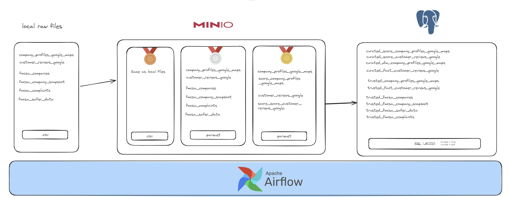

# Clever Data Engineer Trial Project

# Developed Solutions

## 1. Interfaces and Code Implementations for Data Processing

I developed a modular architecture using interfaces and different backends such as **Pandas** and **PySpark** for data manipulation. Following SOLID fundamentals.
[data_processor doc](docs/data_processor_doc.md)
[reader_writer_processor doc](docs/reader_writer_doc.md)

Key functionalities include:

- **S3** file management (via MinIO):
  - Moving files between different storage locations.
  - Efficient reading and writing of files. 
  - Implementing *upsert* operations.

In addition, I created several auxiliary functions to optimize the data processing.

## 2. Orchestration with Apache Airflow

I built **DAGs** in **Airflow** to automate the data flow.:

- Data extracted from the **Google Maps**.
- Data from **FMCSA** (Federal Motor Carrier Safety Administration).

Each data file is processed individually through pipeline functions, ensuring modularity and flexibility.

[Pipelines folder](dags/pipelines)

## 3. Lake House Architecture

I implemented a **Lake House** architecture using **Airflow**, **MinIO** (S3 simulation), and **PostgreSQL**, with distinct layers:

- **Bronze**: Raw data in its original format.
- **Silver**: Processed and trusted data stored in *trusted* tables within PostgreSQL.
- **Gold**: Curated and ready-to-consume data stored in *curated* tables in PostgreSQL, optimized for analysis.

## 4. Data Analysis with Jupyter Lab

I conducted exploratory data analysis using a **Jupyter Lab** notebook, focusing on the `company_profiles_google_maps` file. This file provides insights generated from data about company profiles. 

Including: 
- top real state companies by companies score
- acessibility and diversity friendly by city
- most common used adjetives in reviews

[notebook file](notebooks/real_state_analysis_data.ipynb)

## 5. Scores

Two scores were developed: one for evaluating "company profiles" and another for "customer reviews." Each one is in a individual curated table
To be honest, I don’t have deep expertise in score creation, so I consulted ChatGPT to validate ideas and then implemented the solution. I understand that this scenario closely resembles real-world situations where a data scientist would ideate and design the model, while the data engineer would be responsible for the implementation. This collaboration allows leveraging domain-specific knowledge while ensuring scalable and efficient deployment.

[Company profile score explanation](docs/score_explanation/company_profiles)

[Customer review score explanation](docs/score_explanation/user_reviews)

## 6. Interactive Application with Streamlit

I developed a **Streamlit app** that allows users to input data and generate customized content based on their responses. This app serves as a user-friendly interface to interact with the data intuitively.
Here an example:

[AI Generated markdown](docs/auto_generated_md.md)

To works its necessary to use a OpenAI API key

## Data Engineering Challenge: Observations and Reflections

### General Overview
The data trial was somewhat challenging, but I enjoyed the development process. It allowed me to explore a range of data engineering concepts while delivering a practical solution.

### Interfaces and Classes
I built the key classes for this trial from scratch, aiming to follow SOLID principles. However, due to time constraints, there were moments where I deviated from these principles to speed up development. Despite this, the overall structure is modular and could be easily extended or refactored for future improvements.

### Pandas and PySpark Support
The `data_processor` classes are designed to support both Pandas and PySpark backends. My original goal was to deliver both implementations for flexibility, but due to time limitations, I opted to proceed only with the Pandas version. In a production environment, providing both options would offer more versatility depending on data size and computational needs.

### Upsert Functions
The upsert functions I implemented are straightforward. They keep all the data in a single file, which works for this trial. However, in a production-grade lakehouse architecture, a more robust solution would be required. This would involve handling multiple historical files efficiently and possibly employing partitioning strategies.

### Streamlit App
As mentioned in the challenge description, the company has been working on delivering personalized content for readers. To reflect this, I built a small prompt using Streamlit. This prompt generates tailored data for a user interested in buying or selling a house, leveraging information from the Google tables provided in the challenge.
To works its necessary to use a OpenAI API key

### FMCSA Files
Due to time constraints, I didn’t delve deeply into processing the FMCSA files in the gold layer. My focus was on the Google tables, as they were more directly related to the core task at hand.

## Goal of the Project:

At Clever, we are turning data into personalized and localized content so our readers can make well-informed decisions about any step of their real estate journey.

Please fork this repository and let us know when you've completed the project with a link to your fork.

Using the data set decribed below, and the Airflow-based data pipeline docker configuration, perform basic analysis for the chosen in `company_profiles_google_maps.csv`. There are basic errors on the DAG that you will need to fix for the pipeline to work properly. 

## Expectations
To perform this project you will need to:
* Perform transforms on the raw data and load them into a PostgreSQL database
* Be able to join datasets together in way for an analyst to be able to rank by a certain set of criteria (you can determine this criteria)
* Be able to filter the data by city or state so analysis can be performed by locality
* Given a locality, create a ranked list according to the criteria you’ve chosen

**Bonus:**
* Interesting additional analysis based on the underlying data
* An example could be Review Sentiment, common themes among ratings, complaints, etc.

## Dataset
Moving company data set (files can be found at 'dags/scripts/data_examples' folder)
* fmcsa_companies.csv
* fmcsa_company_snapshot.csv
* fmcsa_complaints.csv
* fmcsa_safer_data.csv
* company_profiles_google_maps.csv
* customer_reviews_google.csv

## Getting started
To get started with Airflow check the [getting started](docs/getting_started.md) documentation.
